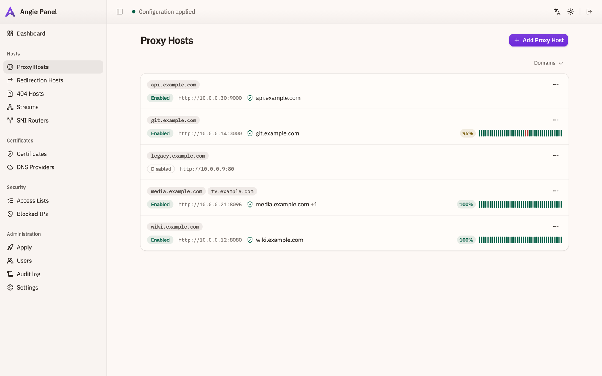
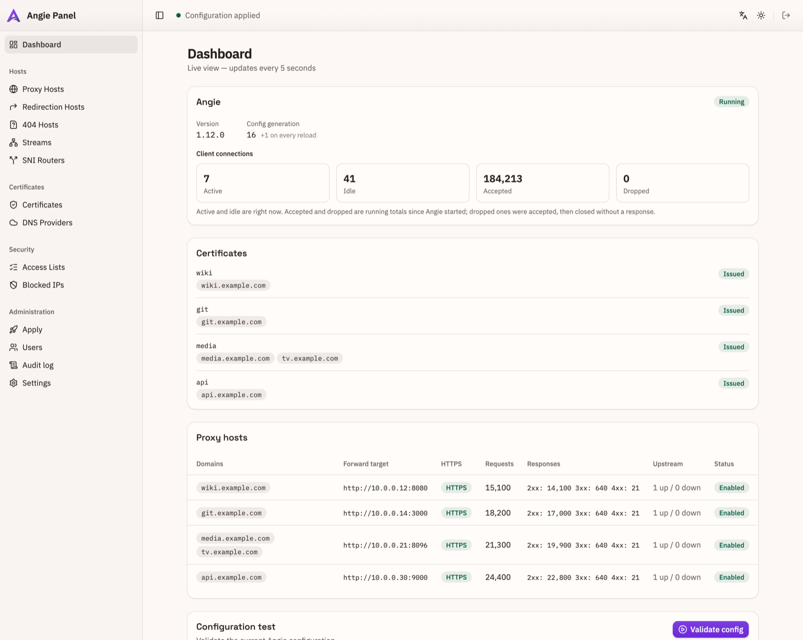
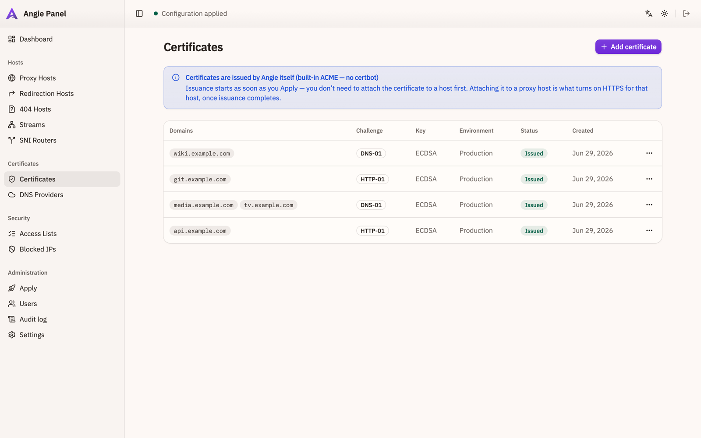
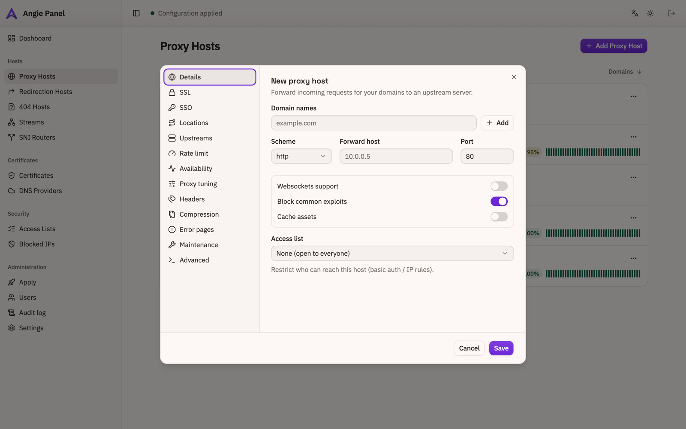
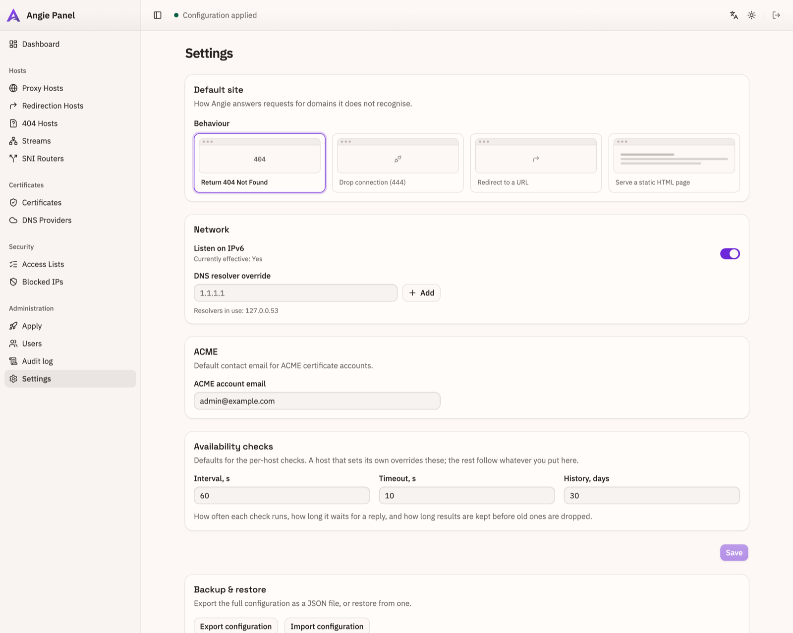

# Angie Panel

> 🇷🇺 [Читать по-русски](README.rus.md) · 🌐 [angie-panel site](https://maxname.github.io/angie-panel/)

[](https://github.com/maxname/angie-panel/actions/workflows/ci.yml)


A web UI for running [Angie](https://en.angie.software/) as a reverse proxy — think
nginx-proxy-manager, but a plain systemd service instead of a Docker stack, with
certificates issued by Angie's own ACME module instead of certbot.

Built for small always-on boxes: a single static binary, no runtime dependencies, and
~10–20 MB of RAM.



## Why this instead of nginx-proxy-manager

- **Angie issues the certificates, not certbot.** http-01, tls-alpn-01 and dns-01
  (including wildcards) are handled by Angie's built-in ACME module. No certbot, no pip,
  no renewal cron — and no container to keep alive just to hold a certificate.
- **The apply pipeline tells you the truth.** You see a diff before anything is written.
  The staged config is validated with `angie -t`, written atomically, and rolled back from
  a snapshot if the reload fails. Config drift on disk is detected and shown.
- **The panel never runs as root.** It generates config as an unprivileged user; a small
  auditable helper — the same binary, invoked through a systemd oneshot unit behind polkit
  — is the only thing that writes to `/etc`.
- **No Docker anywhere.** One `.deb`, one systemd service, one SQLite file.
- **Uptime monitoring built in.** Per-host TCP and HTTP(S) checks with history, shown as
  an uptime bar right in the host list.
- **A real CLI, not just a web UI.** `apctl status`, `apctl apply`, and `export`/`import`
  for configuration in git. It talks to the same API the browser does, so scripted changes
  get the same validation, rollback and audit trail. See [docs/cli.md](docs/cli.md).

## Screenshots

| | |
|---|---|
| **Dashboard** — live Angie metrics, certificate state, per-host traffic | **Certificates** — issued by Angie, http-01 / dns-01 / wildcard |
|  |  |
| **Host editor** — thirteen sections, from SSL to rate limits | **Settings** — defaults for the whole install |
|  |  |

## Install

Debian/Ubuntu on `amd64` or `arm64`, with Angie already installed
(see [docs/deploy-nanopi.md](docs/deploy-nanopi.md) for a full walkthrough on a fresh box):

```bash
curl -fsSL https://github.com/maxname/angie-panel/releases/latest/download/install.sh -o install.sh
less install.sh          # read it before running it
sudo bash install.sh
```

There is no default password. Read the one-time setup token and create the first admin:

```bash
sudo cat /var/lib/angie-panel/setup-token
```

Then open `http://<host>:8080/setup`. Details and the upgrade path:
[docs/installation.md](docs/installation.md).

Releases ship `.deb` packages for both architectures, `SHA256SUMS.txt`, and — when a signing
key is configured — detached GPG signatures.

## Feature tour

**Hosts.** Proxy hosts, redirection hosts, 404 hosts, TCP/UDP streams and SNI routers.
Per host: websockets, HTTP/2 and HTTP/3, HSTS, custom locations, upstreams with load
balancing, rate limits, custom headers, gzip, error pages, maintenance mode, mTLS, forward
auth, and a raw snippet escape hatch.

**Certificates.** Issued and renewed by Angie. DNS-01 works through provider APIs via a
vendored `acme.sh` (Cloudflare, reg.ru, Route 53, and others); the hook waits for the TXT
record to propagate to every authoritative nameserver before telling the CA to check.

**Availability.** Opt-in TCP and HTTP(S) checks per host, on their own schedule. HTTP
checks go over loopback with the host's domain as SNI and verify the certificate — so they
report whether *your Angie* serves the site. They cannot tell you the internet reaches you;
nothing running on the box can.

**Security.** Access lists (basic auth + IP rules), an IP blocklist, GeoIP country policy,
an audit log, and role-based users.

**Operations.** Config export/import as JSON, apply history, drift detection, and a
dashboard fed by Angie's own status API.

## Architecture

A Rust ([axum](https://github.com/tokio-rs/axum)) backend with the React UI embedded in the
binary. Everything lives in SQLite; the files under `/etc/angie/http.d/` are a deterministic
projection of that database, never edited by hand.

Applying changes goes: lint → `angie -t` against a staged copy → snapshot → atomic sync →
graceful reload, with an automatic rollback if any step fails. The privileged half is a
handful of oneshot systemd units the panel can start through polkit, and nothing else.

```
frontend/    React 19 + Vite + Tailwind + shadcn/ui
backend/     Rust: axum, sqlx/SQLite, config generator, ACME hook, root helper
packaging/   .deb metadata, systemd units, polkit rules, install.sh
e2e/         real Angie + pebble, exercising issuance end to end
docs/        installation, certificates, CLI, security, troubleshooting
```

More detail: [PLAN.md](PLAN.md) (Russian) and [docs/research/](docs/research/).

## Development

```bash
# backend — rust-embed needs the frontend directory to exist at compile time
mkdir -p frontend/dist && touch frontend/dist/index.html
cd backend && cargo run -- serve --config ../dev/angie-panel.toml

# frontend
cd frontend && pnpm install && pnpm dev
```

The UI is at <http://127.0.0.1:5173> and proxies `/api` to the backend on port 8080.

Checks, all of which CI runs on every push:

```bash
cd backend  && cargo fmt --check && cargo clippy --all-targets && cargo test
cd frontend && pnpm lint && pnpm typecheck && pnpm test && pnpm build
cd e2e      && ./run.sh        # real Angie + pebble; needs Docker
```

## Status

Feature-complete and running on real hardware. Certificate issuance is exercised against a
real Angie + [pebble](https://github.com/letsencrypt/pebble) on every CI push, and the
panel is deployed and verified on a NanoPi R6S (Armbian/Debian 13, arm64) — install,
migrations, apply, live certificate issuance through reg.ru DNS-01, and the availability
scheduler writing real beats.

This is a personal project used in production by its author. It has not been through an
external security review; see [SECURITY.md](SECURITY.md) before exposing the panel to the
internet.

## Contributing

Issues and pull requests are welcome — see [CONTRIBUTING.md](CONTRIBUTING.md) for how to
run the checks and what the commit history expects.

## License

[MIT](LICENSE).

The `.deb` vendors [acme.sh](https://github.com/acmesh-official/acme.sh) for DNS-01 provider
APIs. Those scripts keep their own GPLv3 license and are invoked as a subprocess, not linked.
